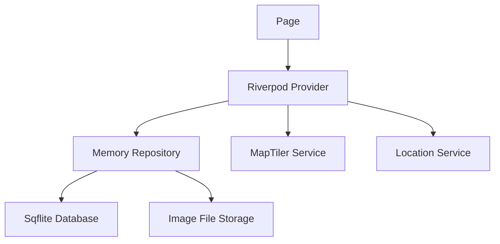

# Trip Memories - Technical Architecture

## Tổ chức source
```text
lib/
  app/
    trip_memories_app.dart
    app_routes.dart
    theme/
  core/
    config/
    permissions/
    utils/
  data/
    local/
    models/
    repositories/
    services/
  features/
    memories/
      providers/
      pages/
      widgets/
  ui/
    atoms/
    molecules/
    organisms/
    templates/
```

## Luồng dữ liệu


## Layer chính
- UI: chia theo Atomic Design, tái sử dụng component từ `ui/`.
- Feature: đặt page, provider và widget liên quan đến memory trong `features/memories/`.
- Data: model, repository, local database và services.
- Core: cấu hình app, permission helpers và tiện ích dùng chung.

## State management
- `memoryRepositoryProvider`: cung cấp repository thao tác database.
- `memoryListProvider`: load danh sách memory từ local database.
- `selectedMapTargetProvider`: giữ tọa độ cần focus từ list/search sang map.
- `locationControllerProvider`: quản lý quyền và vị trí hiện tại.
- `mapSearchControllerProvider`: gọi MapTiler Geocoding và quản lý kết quả tìm kiếm.

## Database
Bảng `memories`:
- `id` TEXT primary key.
- `title` TEXT not null.
- `note` TEXT nullable.
- `latitude` REAL not null.
- `longitude` REAL not null.
- `image_paths` TEXT JSON array.
- `created_at` TEXT ISO-8601.
- `updated_at` TEXT ISO-8601.

## Cấu hình MapTiler
- Không commit API key vào source.
- Ưu tiên truyền qua:
```sh
flutter run --dart-define=MAPTILER_API_KEY=your_key
```
- Trong code đọc bằng:
```dart
const mapTilerApiKey = String.fromEnvironment('MAPTILER_API_KEY');
```

## Quyền thiết bị
- iOS: khai báo Location, Camera, Photo Library trong `Info.plist`.
- Android: khai báo quyền tương ứng trong `AndroidManifest.xml`.
- UI phải có trạng thái rõ ràng khi quyền bị từ chối hoặc bị từ chối vĩnh viễn.
